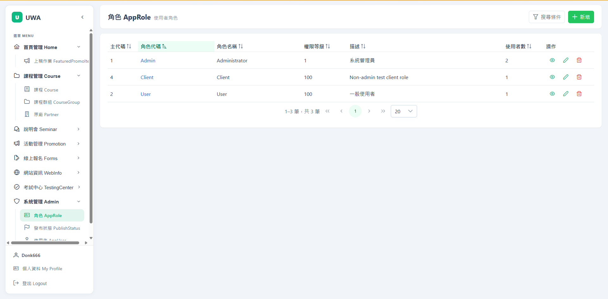
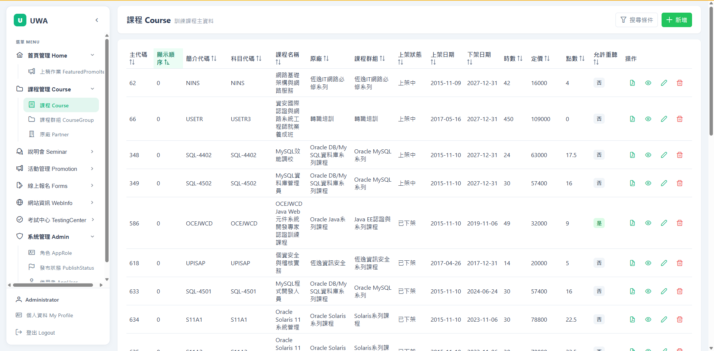
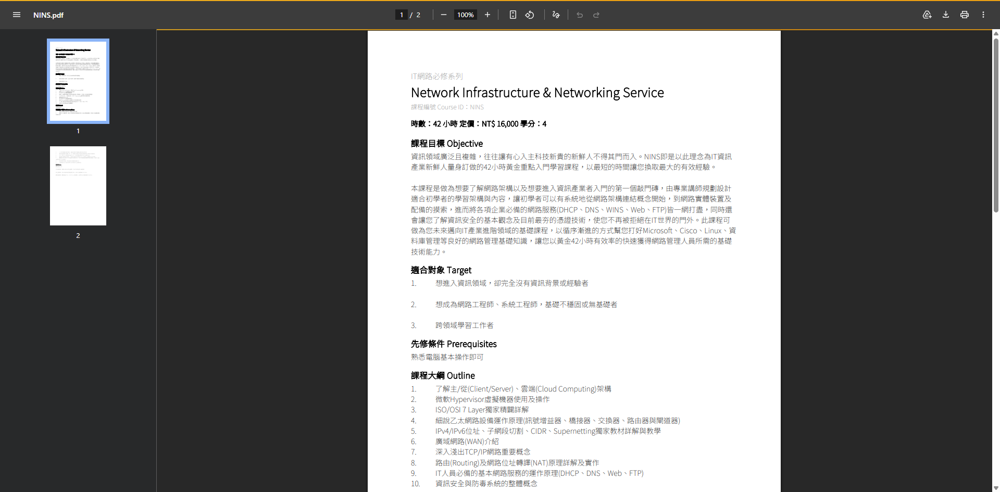
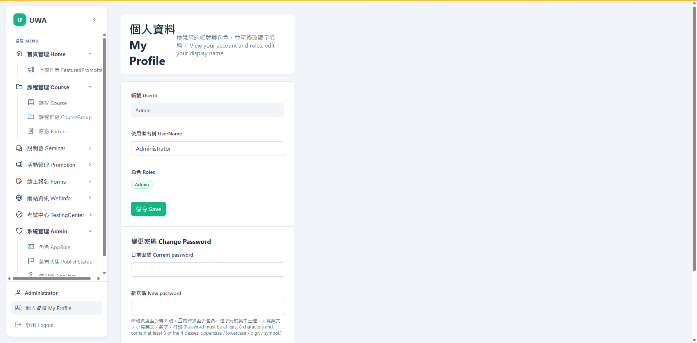
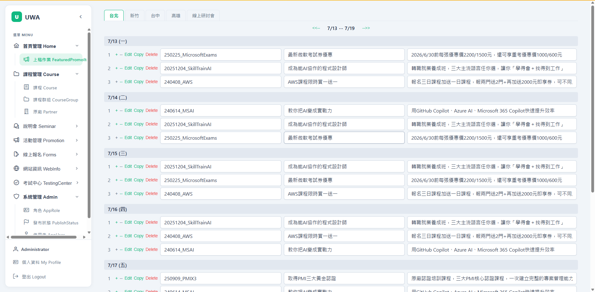
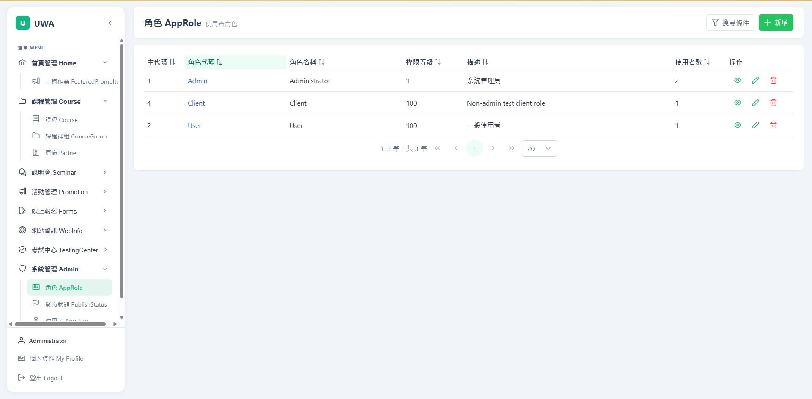
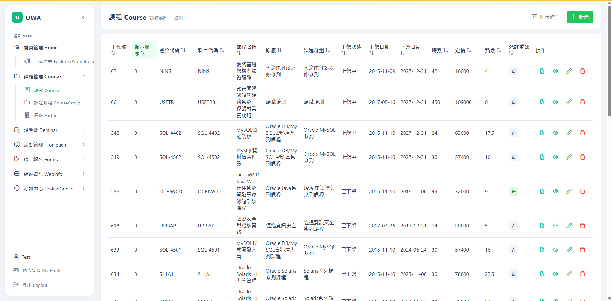

# CMS — Full-Stack App

A full-stack CMS built from the existing database schema (`database/*.sql`) following
`spec/code-gen.convention.md`. First feature: **CRUD AppRole** (系統管理 Admin → 角色 AppRole).

## Screenshots

A look at the running app — Angular 20 + PrimeNG frontend, .NET 9 API. Full captioned gallery:
[`docs/screenshots/`](docs/screenshots/README.md).

| Login (登入) | Course catalogue (課程) | Course PDF export (課程 PDF) |
|:---:|:---:|:---:|
|  |  |  |
| Bilingual login, JWT auth. | Sortable/filterable list; per-row PDF / view / edit / delete. | Server-rendered PDF (title, hours/price/credits, outline). |

| My Profile (個人資料) | Featured promo items (上稿作業) | Roles — admin (角色 AppRole) |
|:---:|:---:|:---:|
|  |  |  |
| View account/roles, edit name, change password. | Home-page featured slots. | Roles with N-N user assignment (admin-only). |

**Role-based access** — the non-admin `Test` user sees no **系統管理 Admin** section (admin routes are
guarded client-side and enforced server-side with `[Authorize(Roles="Admin")]`):



## Layout

```
src/
  CMS.slnx              .NET solution
  CMS.API/              .NET 9 Web API (Dapper, Swagger, CORS) — port 5000
  CMS.API.Tests/        xUnit tests (mock-based, no live DB required)
  CMS.NG/               Angular 20 + PrimeNG SPA — port 4200
```

## Backend — CMS.API

- .NET 9 Web API, **Dapper** (no EF), async endpoints.
- Connection string `CMS` in `CMS.API/appsettings.json` targets `.\SQLEXPRESS` / `CMS` DB.
- Swagger UI at `http://localhost:5000/swagger`.
- CORS allows any localhost origin (e.g. the Angular dev server).

Run:
```bash
cd src
dotnet run --project CMS.API        # http://localhost:5000/swagger
dotnet test CMS.slnx                # run backend unit tests
```

### AppRole API (`/api/approles`)

| Method | Route                    | Description              |
|--------|--------------------------|-------------------------|
| GET    | `/api/approles`          | List all roles          |
| POST   | `/api/approles/query`    | Filtered search         |
| GET    | `/api/approles/{id}`     | Single role (by RoleId) |
| POST   | `/api/approles`          | Create                  |
| PUT    | `/api/approles`          | Update (RoleId in body) |
| DELETE | `/api/approles/{id}`     | Delete                  |
| GET    | `/api/lookups/app-users` | User lookup (multi-select) |

`RoleId` (string) is the primary key; `{id}` routes are not `:int`-constrained and the
client `encodeURIComponent`s the value. The AppRole ↔ AppUser N-N (junction `AppUserRole`)
drives the 使用者數 count column and the users multi-select.

## Frontend — CMS.NG

- Angular 20 standalone components + **PrimeNG** (Aura theme).
- API base URL configured in `src/environments/environment*.ts` (no proxy).
- Path aliases: `@env/*`, `@core/*`, `@features/*`.

Run:
```bash
cd src/CMS.NG
npm install                                      # first time only
npm start                                         # ng serve → http://localhost:4200
npm test                                          # ng test (Karma + Jasmine)
# headless: npx ng test --watch=false --browsers=ChromeHeadless
```

The dev server (port 4200) uses `environment.development.ts`, which points at the
API on `http://localhost:5000/api`. Start the API first, then the Angular app.
```
