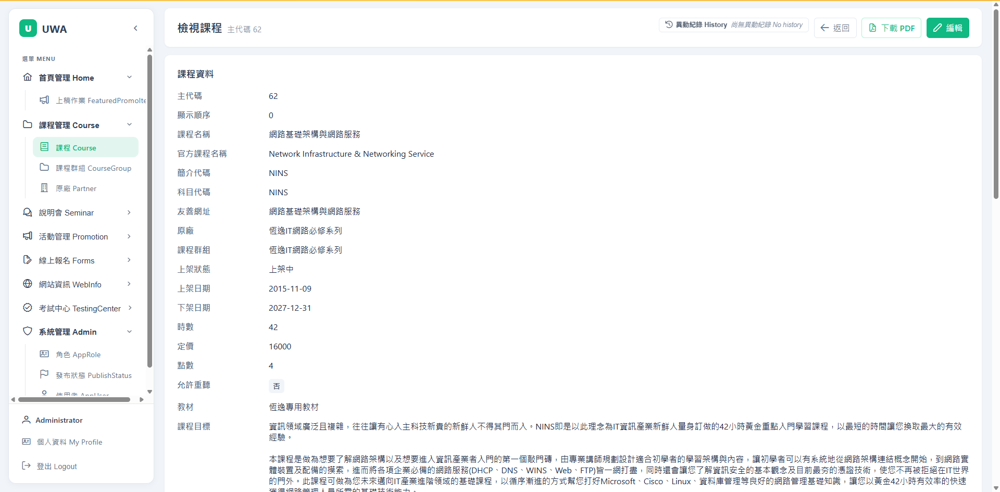
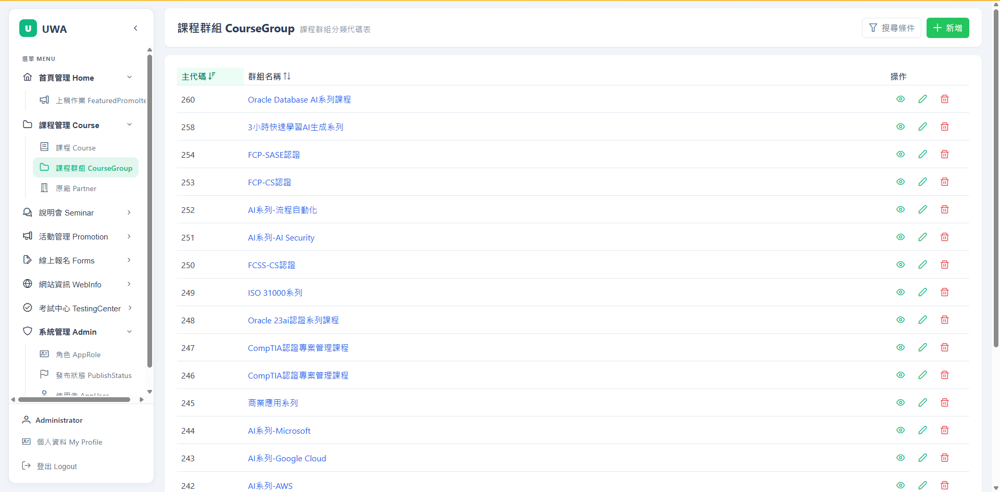
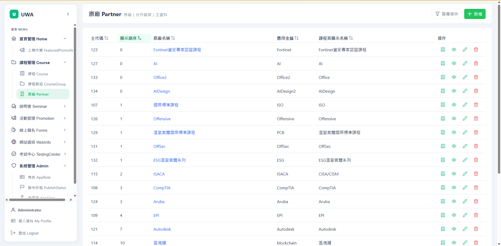
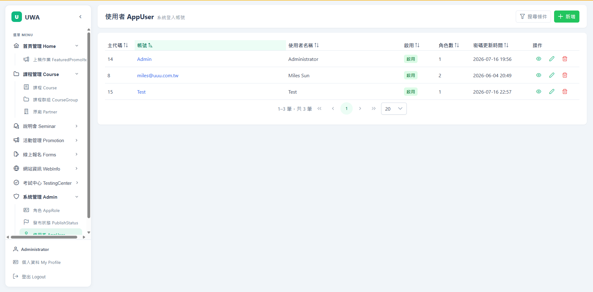
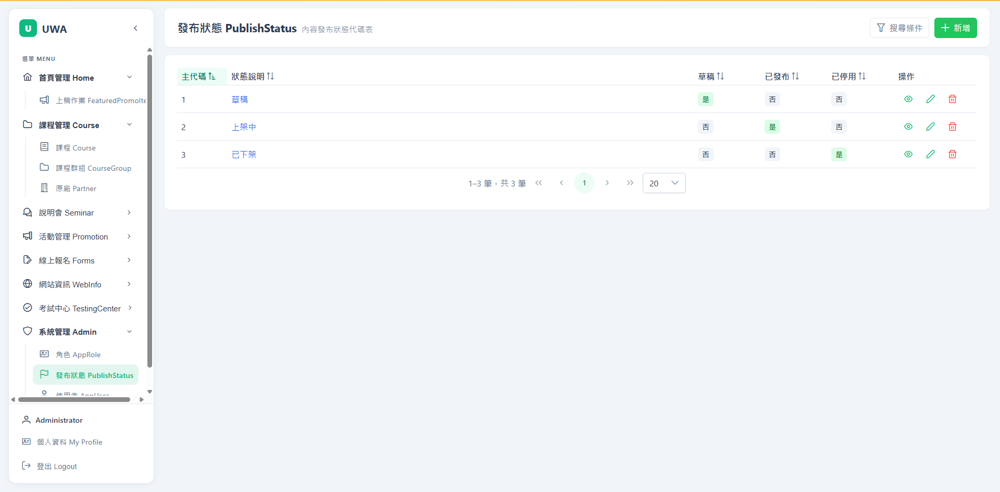

# CMS — Screenshots

Smoke-test capture of the running app (Angular 20 + PrimeNG on `:4200`, .NET 9 API on `:5000`),
one shot per feature. Admin views are logged in as `Administrator` (role `Admin`); the last shot is the
non-admin `Test` user to show role-based access.

> Regenerate with `/open-gstack-browser` → feature tour. Images are plain PNGs; embed them in the root
> README with the copy-paste block at the bottom.

## Gallery

### Authentication
| Login (登入) | My Profile + Change Password (個人資料) |
|---|---|
|  |  |
| Bilingual login; issues a signed JWT. | View account/roles, edit display name, change password (server-enforced policy). |

### Course management
| Course catalogue (課程) | Course detail |
|---|---|
|  |  |
| Sortable/filterable list; per-row PDF / view / edit / delete. | Single course record. |

| Course groups (課程群組) | Partners (原廠) |
|---|---|
|  |  |
| Grouping used by the catalogue. | Course vendor / 原廠 records. |

### Course PDF export (課程 PDF)
| Server-rendered PDF |
|---|
|  |
| `GET /api/courses/{courseId}/pdf` — anonymous, published-only, MigraDoc-rendered (title, hours/price/credits, objectives, outline). |

### Home / promotions
| Featured promo items (上稿作業) |
|---|
|  |
| Home-page featured slots (schedule × training center × slot). |

### Admin (系統管理) — role-gated to `Admin`
| Roles (角色 AppRole) | Users (使用者 AppUser) | Publish statuses (發布狀態) |
|---|---|---|
|  |  |  |
| Roles with N-N user assignment. | User accounts + role assignment. | Publish-status lookup. |

### Role-based access control
| Non-admin (`Test`) view |
|---|
|  |
| The `Test` user (no `Admin` role) sees no **系統管理 Admin** section — admin routes are guarded client-side and enforced server-side with `[Authorize(Roles="Admin")]`. |

---

## Copy-paste for the root `README.md`

Paths are prefixed with `docs/screenshots/` so they resolve from the repo root:

```markdown
## Screenshots

| Login | Course catalogue | Course PDF export |
|---|---|---|
|  |  |  |

| My Profile / Change Password | Featured promo items | Admin — Roles |
|---|---|---|
|  |  |  |

Role-based access — the non-admin `Test` user sees no admin section:


```
